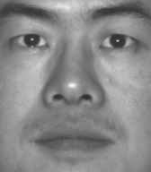

# Photometric Stereo
This repository contains code for running color and greyscale photometric stereo on a sequence of images that have their incident light direction documented.
This repo contains images for 5 different objects - a color and greyscale sphere and monkey, and a greyscale face from the [Yale face database](http://vision.ucsd.edu/content/yale-face-database).

# Example
Image sequence followed by the surface reconstruction.     

